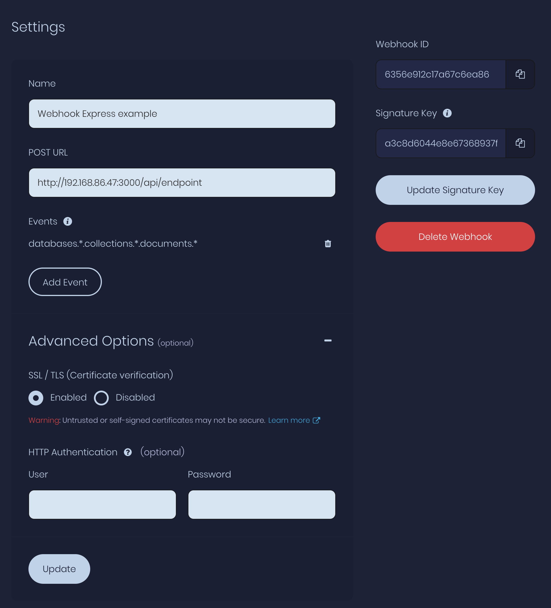

# Webhook Example for Appwrite using Express

Once you have an instance setup, you can add a webook to capture any event.
For this example I have setup a listener for all events against



- `npm install`
- `npm start`
- Add, Update, Delete documents to see what payload looks like
- Watch console for logs

Payload should show something like
```
{
  completed: true,
  text: 'asdf',
  '$id': '6356ebc22aaabfa5500a',
  '$permissions': [],
  '$createdAt': '2022-10-24T19:47:14.175+00:00',
  '$updatedAt': '2022-10-24T19:47:14.175+00:00',
  '$collectionId': 'playground-collection',
  '$databaseId': 'playground-db'
}
```